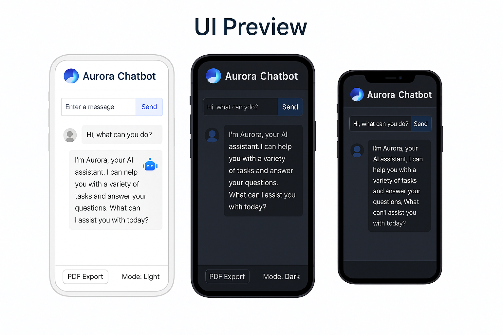

<p align="center">
  
</p>

# Aurora Chatbot 🌌

Aurora is an intelligent, lightweight, and customizable AI-powered chatbot system that integrates with OpenAI's ChatGPT via API. Designed using **Streamlit**, this project supports dynamic UI themes, local database storage, and PDF export of conversation history — all optimized for both local and cloud deployment.


---

## 🚀 Key Features

- 🔧 ChatGPT Integration – Uses OpenAI's GPT API for intelligent, contextual conversations  
- 🖥️ Responsive Frontend UI – Built with Streamlit for fast deployment and mobile adaptation  
- 🌓 Day/Night Mode Toggle – Switch UI themes for better user experience  
- 🗃️ Database Support – Local SQLite database stores user interactions  
- 📄 Export Chat to PDF – Save important conversations for review or recordkeeping  
- 🌐 Local & GitHub Deployment – Supports local testing and cloud-based deployment  

---
## 🖼️ UI Preview

<p align="center">
  
</p>


 🛠️ Tech Stack

| Layer         | Technology                     |
| ------------- | ------------------------------ |
| Frontend      | Streamlit                      |
| Backend       | Python, OpenAI API (ChatGPT)   |
| Database      | SQLite                         |
| Deployment    | GitHub + Local Server          |
| Extras        | FPDF / ReportLab (for PDF export) |

---

 🧱 System Architecture

```
User
   │
   ▼
Frontend UI (Streamlit)
 ├──► ChatGPT API (OpenAI)
 ├──► SQLite Database
 ├──► PDF Export Module
 └──► Deployment: GitHub & Local
```

📌 Diagram available at `docs/aurora_architecture_clean.png`

---

🧪 How to Run

 🔧 Prerequisites

- Python 3.8+
- OpenAI API Key
- Recommended: Virtual environment

💻 Setup

```bash
git clone https://github.com/frida0811/aurora-chatbot.git
cd aurora-chatbot
pip install -r requirements.txt
streamlit run Chatweb.py
```

---
 📁 Project Structure


aurora-chatbot/
├── Chatweb.py
├── requirements.txt
├── logo.png
├── README.md
└── /docs
    └── aurora_architecture_clean.png


---

👩‍💻 Contributor Roles

- Frida YuZhao  
  - Frontend design & UI development  
  - Local database integration  
  - Cloud and local deployment management

---

🧠 Future Improvements

- Integrate image/audio input for multimodal capabilities  
- Enhance long-context memory across conversations  
- Add multilingual support for global users  
- Improve mobile responsiveness and UX animation  

---

📜 License

This project is licensed under the MIT License.

---
